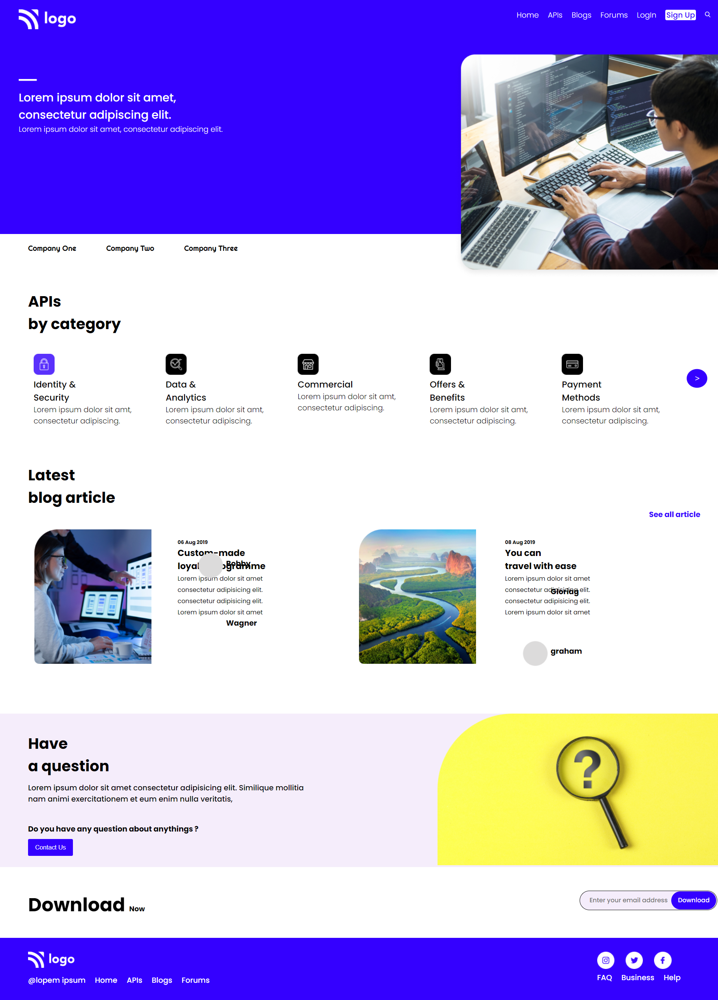

# HTML Project 9
**I Am Abhishek Singh**
> This is my Nineth project of HTML and CSS and it have one page content with length of page is bigger than most of the previous pages and Obvousily it is bit challenging.

 #

## Project Web page

In this project I lerned more depth of flexbox and button inside input by using translateX and diffrence between justify content and align self the diffrence is justify-content work horizontally
and align-self work on vertically.

#

### Duration Of Completing this project
> Honestly it took me more than **6 hours** .

[Visit This Project Live](https://abhi-project-1.netlify.app/)

#

To see my work visit my [Portfolio]("my-portfolio-website")

